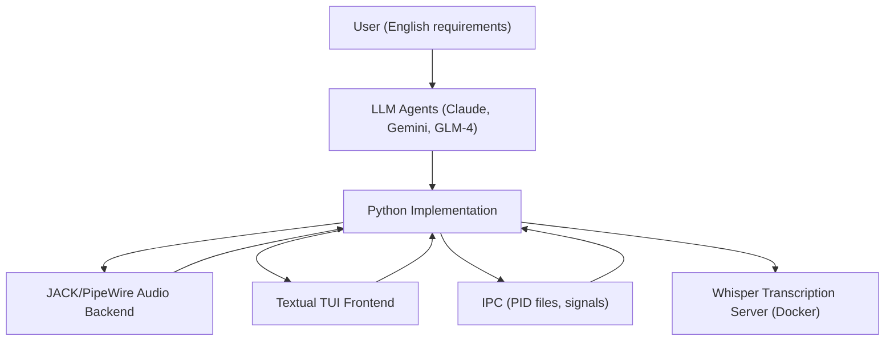

# Omega-13 🌌

[![zread](https://img.shields.io/badge/Ask_Zread-_.svg?style=for-the-badge&color=00b0aa&labelColor=000000&logo=data%3Aimage%2Fsvg%2Bxml%3Bbase64%2CPHN2ZyB3aWR0aD0iMTYiIGhlaWdodD0iMTYiIHZpZXdCb3g9IjAgMCAxNiAxNiIgZmlsbD0ibm9uZSIgeG1sbnM9Imh0dHA6Ly93d3cudzMub3JnLzIwMDAvc3ZnIj4KPHBhdGggZD0iTTQuOTYxNTYgMS42MDAxSDIuMjQxNTZDMS44ODgxIDEuNjAwMSAxLjYwMTU2IDEuODg2NjQgMS42MDE1NiAyLjI0MDFWNC45NjAxQzEuNjAxNTYgNS4zMTM1NiAxLjg4ODEgNS42MDAxIDIuMjQxNTYgNS42MDAxSDQuOTYxNTZDNS4zMTUwMiA1LjYwMDEgNS42MDE1NiA1LjMxMzU2IDUuNjAxNTYgNC45NjAxVjIuMjQwMUM1LjYwMTU2IDEuODg2NjQgNS4zMTUwMiAxLjYwMDEgNC45NjE1NiAxLjYwMDFaIiBmaWxsPSIjZmZmIi8%2BCjxwYXRoIGQ9Ik00Ljk2MTU2IDEwLjM5OTlIMi4yNDE1NkMxLjg4ODEgMTAuMzk5OSAxLjYwMTU2IDEwLjY4NjQgMS42MDE1NiAxMS4wMzk5VjEzLjc1OTlDMS42MDE1NiAxNC4xMTM0IDEuODg4MSAxNC4zOTk5IDIuMjQxNTYgMTQuMzk5OUg0Ljk2MTU2QzUuMzE1MDIgMTQuMzk5OSA1LjYwMTU2IDE0LjExMzQgNS42MDE1NiAxMy43NTk5VjExLjAzOTlDNS42MDE1NiAxMC42ODY0IDUuMzE1MDIgMTAuMzk5OSA0Ljk2MTU2IDEwLjM5OTlaIiBmaWxsPSIjZmZmIi8%2BCjxwYXRoIGQ9Ik0xMy43NTg0IDEuNjAwMUgxMS4wMzg0QzEwLjY4NSAxLjYwMDEgMTAuMzk4NCAxLjg4NjY0IDEwLjM5ODQgMi4yNDAxVjQuOTYwMUMxMC4zOTg0IDUuMzEzNTYgMTAuNjg1IDUuNjAwMSAxMS4wMzg0IDUuNjAwMUgxMy43NTg0QzE0LjExMTkgNS42MDAxIDE0LjM5ODQgNS4zMTM1NiAxNC4zOTg0IDQuOTYwMVYyLjI0MDFDMTQuMzk4NCAxLjg4NjY0IDE0LjExMTkgMS42MDAxIDEzLjc1ODQgMS42MDAxWiIgZmlsbD0iI2ZmZiIvPgo8cGF0aCBkPSJNNCAxMkwxMiA0TDQgMTJaIiBmaWxsPSIjZmZmIi8%2BCjxwYXRoIGQ9Ik00IDEyTDEyIDQiIHN0cm9rZT0iI2ZmZiIgc3Ryb2tlLXdpZHRoPSIxLjUiIHN0cm9rZS1saW5lY2FwPSJyb3VuZCIvPgo8L3N2Zz4K&logoColor=ffffff)](https://zread.ai/b08x/omega-13)

> *"It's a time machine... but it only goes back 13 seconds."*

## 🤖 About This Project

Omega-13 is an experiment in natural language programming: a retroactive audio recording and transcription system built by iteratively specifying requirements in English and using large language model (LLM) coding assistants and agents to generate, debug, and evolve the implementation. This project demonstrates how disparate programming languages and system components can be coalesced through a workflow where English serves as the source code, and AI models act as the compiler and implementer. The following documentation outlines the architecture, development process, and lessons learned, with references to deeper technical details and project evolution.

## 🎙️ Purpose and Scope

Omega-13 addresses the need to capture and transcribe fleeting audio moments—such as spontaneous thoughts or conversations—by continuously recording audio in memory and allowing users to retroactively save and transcribe the last several seconds on demand. The system is designed for privacy (local transcription), real-time performance, and seamless integration with modern Linux desktops, including those running under Wayland.

## 🏗 Architecture: Natural Language Specification → Implementation

The architecture is the result of a declarative, iterative process: requirements are described in English, and LLM agents translate them into working code. The human remains the programmer, but the language shifts from Python (or C, or Bash) to English. The AI is the compiler, not the author.

### 📊 High-Level Flow

- The user specifies needs in English (e.g., "Always record in memory, save the past 13 seconds when triggered").
- LLM agents translate requirements into architecture and code, iterating on feedback and new specifications.
- The Python implementation orchestrates a Textual TUI frontend, a JACK/PipeWire audio backend with a ring buffer, RMS-based signal detection, a state machine for recording control, and a local Whisper transcription server running in Docker.
- Inter-process communication uses PID files and signals to work around Wayland security constraints, enabling global hotkeys and seamless OS integration.

### 📦 Key Components

- **Textual TUI Frontend:** Provides a keyboard-driven terminal interface for control and feedback.
- **JACK/PipeWire Audio Backend:** Continuously records audio into a ring buffer, enabling retroactive capture.
- **Signal Detection:** Uses RMS-based energy monitoring to trigger recording only when voice activity is detected, reducing empty or noisy captures.
- **Recording Controller:** Implements a finite state machine to manage recording lifecycle and transitions.
- **Transcription:** Ships reconstructed audio to a local Whisper server for transcription, ensuring privacy and low latency.
- **IPC:** Employs PID files and SIGUSR1 signals for reliable control, especially under Wayland.

For a detailed breakdown of modules, threading constraints, and anti-patterns encountered during AI-driven development, see [AGENTS.md](https://github.com/b08x/omega-13/blob/a73786378ea1683937ab3bd5bc5533ac87c26017/AGENTS.md#L9-L117).

### 📊 Example: Ring Buffer Mechanics

The audio backend uses a modulo-wrapped ring buffer to continuously record audio. When the user triggers a save, the system reconstructs the last N seconds by combining the pre-buffer and live queue, then writes a linear WAV file for transcription. This approach was specified in English and implemented by the AI, abstracting away the complexity of real-time audio programming.

## 🕰️ Iterative, LLM-Driven Development

Development is requirement-centric: bugs are described, not debugged; features are specified, not implemented. Each iteration begins with a natural language prompt, and the AI agents propose, generate, or refactor code accordingly. This process has enabled rapid prototyping and adaptation, even for complex, multi-threaded, real-time systems.

The toolchain includes multiple LLMs (Claude, Gemini, GLM-4) and custom development environments for natural language programming and rapid iteration. The workflow is local-first, with no CI/CD, and leverages modern Python packaging and Docker-based deployment for the transcription server.

## 📚 Capabilities and Experience

Omega-13 demonstrates that complex systems with real-time constraints, threading, and cross-language integration can be specified and evolved through natural language programming. The project has grown to support multi-channel input, mono/stereo selection, decibel level display, configurable save paths, session-based workflows, and containerized Whisper transcription with CUDA acceleration. Recent updates include improved signal detection, TUI key bindings, and advanced agent context management protocols. For a full history of features and improvements, see [CHANGELOG.md](https://github.com/b08x/omega-13/blob/a73786378ea1683937ab3bd5bc5533ac87c26017/CHANGELOG.md#L3-L121).

## 🔧 Self-Assessment and Knowledge Gaps

While the LLM-driven approach has enabled rapid progress and a high degree of flexibility, it is not without limitations. The generated code is not always perfect, and there are areas—such as low-level audio performance, advanced threading, and edge-case error handling—where deeper expertise or manual review may be required. The project is an ongoing experiment in collaborative software creation, and both the human and AI contributors continue to learn from each iteration. The documentation, especially [AGENTS.md](https://github.com/b08x/omega-13/blob/a73786378ea1683937ab3bd5bc5533ac87c26017/AGENTS.md#L9-L117), encodes lessons learned, anti-patterns, and operational constraints to guide future development.

## 🤝 Collaboration and Next Steps

Omega-13 is designed to be both a tool and a living case study in natural language programming. Contributions, feedback, and critical review—whether from humans or AI agents—are welcome. The project aspires to lower the barrier to custom software by making English the lingua franca of programming, while remaining grounded in the realities of system integration and operational safety.

For technical deep-dives, implementation details, and guidance for AI collaborators, consult [AGENTS.md](https://github.com/b08x/omega-13/blob/a73786378ea1683937ab3bd5bc5533ac87c26017/AGENTS.md#L9-L117). For a chronological record of changes and feature evolution, see [CHANGELOG.md](https://github.com/b08x/omega-13/blob/a73786378ea1683937ab3bd5bc5533ac87c26017/CHANGELOG.md#L3-L121).
