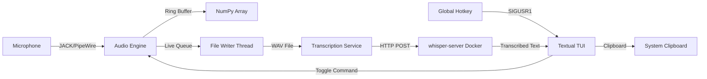

# Omega-13 🌌

**A Retroactive Audio Recorder & Transcription TUI**

> *"It's a time machine... but it only goes back 13 seconds."*

Omega-13 is a terminal-based tool for Linux that maintains a continuous audio buffer in memory. When you trigger a recording, it captures the **previous 13 seconds** of audio (plus whatever follows), saves it, and automatically transcribes it using a local AI model.

It is designed for developers, writers, and power users who speak ideas out loud but often forget to hit "record" until *after* the thought has occurred.

<!-- 
*(The main TUI showing audio levels and transcription status)* -->

## ✨ Key Features

* **🕰️ Retroactive Recording:** Always listens (locally), never misses a thought. Captures the 13 seconds *before* you pressed the key.
* **🔒 Local Privacy:** Uses `whisper.cpp` running locally via Docker. No audio is ever sent to the cloud.
* **🖥️ Textual TUI:** A beautiful, keyboard-centric terminal interface.
* **📋 Clipboard Sync:** Automatically copies transcribed text to your clipboard for immediate pasting into IDEs or notes.
* **🎹 Global Hotkeys:** Trigger recording from anywhere in your OS (supports Wayland/GNOME workarounds).
* **🎛️ JACK/PipeWire Support:** Professional audio routing (supports Mono and Stereo inputs).

---

## 🛠️ Prerequisites

To run Omega-13, your system needs:

1. **Linux** (Tested on Ubuntu/Fedora with GNOME & Wayland).
2. **Audio System:** PipeWire (with `pipewire-jack` installed) or a native JACK server.
3. **Docker & NVIDIA GPU:** Required for the hardware-accelerated transcription backend.
4. **Python 3.12+**.

---

## 📦 Installation

### 1. Set up the Backend (Whisper Server)

Omega-13 delegates heavy AI lifting to a Docker container to keep the TUI snappy.

1. Navigate to the project directory.
2. Start the transcription server:

    ```bash
    docker compose up -d
    ```

    *Note: This pulls a custom image based on `nvidia/cuda` and builds `whisper.cpp` with CUDA support. The first run will take time to compile.*

### 2. Install the Application

Install the Python package locally:

```bash
pip install .
```

---

## ⚙️ Configuration & Audio Setup

### 1. Launching

Run the application from your terminal:

```bash
omega13
```

### 2. selecting Audio Inputs

By default, Omega-13 listens to nothing. You must connect it to an audio source.

1. Press `i` (or `I`) to open the **Input Selector**.
2. Choose **Mono** or **Stereo**.
3. Select your microphone from the list.
    * *Tip:* If you use **NoiseTorch** (as seen in the screenshots), select the `NoiseTorch Microphone` stream for cleaner audio.
4. Verify the **VU Meter** on the left is moving when you speak.

### 3. Setting the Global Hotkey (Important!)

Because Wayland prevents applications from spying on global keystrokes, you must configure a system-level shortcut to "poke" Omega-13.

**The default trigger is `Ctrl + Alt + Space`.**

**For GNOME Users:**

1. Go to **Settings** -> **Keyboard** -> **View and Customize Shortcuts**.
2. Add a **Custom Shortcut**.
3. **Name:** `Omega-13 Toggle`
4. **Command:** `omega13 --toggle`
5. **Shortcut:** `Ctrl + Alt + Space` (or your preference).

Now, pressing this key combination will start/stop recording even if the terminal is not focused.

---

## 🚀 Usage Workflow

1. **Speak your thought.** (Don't worry, you haven't hit record yet).
2. **Trigger the Hotkey** (`Ctrl+Alt+Space`).
    * Omega-13 grabs the audio from 13 seconds ago up to now.
    * The status bar turns **RED** (`RECORDING...`).
3. **Finish speaking.**
4. **Trigger the Hotkey again.**
    * Recording stops.
    * Audio is saved to a temporary session.
    * Transcription begins immediately (Status: `Transcribing...`).
5. **Paste.**
    * Once complete, the text is automatically copied to your clipboard (if enabled).

### Session Management

* **Sessions** are temporary by default (`/tmp/omega13`).
* Press `s` to **Save Session** to a permanent location (e.g., `~/Notebooks`).
* This saves the `.wav` audio, `.txt` transcriptions, and a `session.json` metadata file.

---

## ⌨️ TUI Shortcuts

| Key | Action |
| :--- | :--- |
| `I` | **Inputs:** Configure audio sources. |
| `S` | **Save:** Move current session to permanent storage. |
| `T` | **Transcribe:** Manually re-transcribe the last recording. |
| `Q` | **Quit:** Exit the application. |
| `Ctrl+P` | **Command Palette:** Change themes (Dracula, Monokai, etc). |

---

## 🔧 Troubleshooting

**"Capture Blocked - No Input Signal"**

* Omega-13 checks for silence to prevent empty recordings.
* Ensure your mic is not muted.
* Press `I` to ensure the correct JACK/PipeWire port is connected.

**Global Hotkey not working**

* Ensure the `omega13 --toggle` command works in a separate terminal window.
* Verify your Desktop Environment's keyboard shortcut settings.

**Transcription Failed / Slow**

* Check the Docker container: `docker logs -f whisper-server`.
* Ensure your GPU is accessible to Docker (`nvidia-smi`).

**Audio Dropouts / XRUNs**

* If you hear glitches or the VU meter shows gaps, your system may be under high load.
* Close unnecessary applications to free up CPU resources.
* Consider increasing JACK's buffer size if the problem persists.

**Backend Not Responding**

* Omega-13 assumes the `whisper-server` Docker container is running.
* Verify with: `docker ps | grep whisper-server`
* If stopped, restart with: `docker compose up -d`

---

## ⚠️ Known Limitations

Omega-13 is actively developed. The following technical limitations are known and being addressed:

### Real-Time Safety

> [!WARNING]  
> The JACK `process` callback currently performs memory allocation (NumPy array creation) and logging, which can trigger Python's Garbage Collector and cause audio dropouts under high system load.

**Impact:** Potential audio glitches (XRUNs) during recording  
**Mitigation:** Close resource-intensive applications while recording  
**Roadmap:** Planned refactor to use pre-allocated buffers (Q1 2025)

### External Dependency Management

> [!CAUTION]  
> The application assumes the `whisper-server` Docker container is pre-provisioned and running. There's currently no startup health check or automatic orchestration.

**Impact:** Silent failures or hangs if the backend is unavailable  
**Mitigation:** Manually verify Docker container status before recording  
**Roadmap:** **Inference Host Startup Validation** (Q1 2025)

### Deployment Friction

> [!NOTE]  
> Manual configuration of JACK/PipeWire routing and Docker significantly raises the barrier to entry for new users.

**Impact:** "No audio" support tickets, confusion during setup  
**Mitigation:** Follow the detailed setup guide above  
**Future Enhancement:** Automated setup scripts and better onboarding UX

---

## 🏗️ Architecture Overview

Omega-13 employs a **hybrid architecture** that effectively bridges multiple layers:

* **Frontend:** Python `Textual` TUI app providing a rich, keyboard-centric terminal interface
* **Audio Backend:** `JACK`/`PipeWire` client maintaining a real-time ring buffer (NumPy float32 array)
* **Transcription Backend:** Containerized `whisper.cpp` server with CUDA acceleration for local AI processing

### System Flow



### Key Design Principles

**🔒 Privacy-Centric Design**  
All audio processing and transcription happens locally. By delegating transcription to a local Docker container, no audio data ever leaves your machine, ensuring complete privacy.

**⚡ Real-Time Performance**  
The audio callback runs in JACK's real-time thread, requiring careful thread safety and lock-free operations to avoid audio dropouts (XRUNs).

**🌊 Wayland Compatibility**  
Modern Linux desktops (Wayland) block applications from monitoring global keystrokes for security. Omega-13 uses a clever workaround: a PID-based signal handling mechanism (`SIGUSR1`) where the system shortcut sends signals to the running instance via `omega13 --toggle`.

**🔀 Modular Separation**  
The system maintains clear boundaries between components:

* Audio capture (real-time thread)
* File I/O (separate thread)
* UI updates (async event loop)
* AI inference (external service)

---

## 🗺️ Roadmap

> [!TIP]  
> Items marked with 🔧 directly address known limitations from the design review.

### Q1 2025

* ☐ **Wild Capture Inactivity Auto-stop** - Automatically stop recording after 20 seconds of inactivity
* ☐ **Redundant Failover Inference Strategy** - Failover logic for transcription (Local GPU → Local Intel → Local Generic)
* ☐ 🔧 **Inference Host Startup Validation** - Health checks for whisper-server during startup *(addresses External Dependency Management)*
* ☐ 🔧 **Optimize Audio Callback** - Refactor to use pre-allocated buffers, remove allocations from hot path *(addresses Real-Time Safety)*

### Q2 2025  

* ☐ **Start New Session from UI** - Trigger fresh sessions directly from the interface
* ☐ **Load Saved Sessions** - Browse and load previously saved sessions
* ☐ **3-Pane UI Layout Redesign** - Update to narrow controls, transcription buffer, and AI assistant panes
* ☐ **Transcription Error Correction & Editing** - Support grammar files and UI editing of transcription chunks

### Q3 2025

* ☐ **OpenCode REST Service Integration** - Generate task lists and documentation from session data
* ☐ **Live AI Assistant Integration** - Dedicated UI pane for live AI interaction
* ☐ **Specialized Docker Images** - Create Intel-optimized and generic Docker images

### Future Enhancements

* ☐ **Transcription Buffer Formatting Cleanup** - Improve visual formatting for better readability
* ☐ **Screenshot Capture & VLM Analysis** - Screenshot functionality with AI metadata analysis
* ☐ **Screencast Support & Correlation** - Video recording with session metadata correlation

---

*Built with ❤️ for those who think faster than they can type.*
